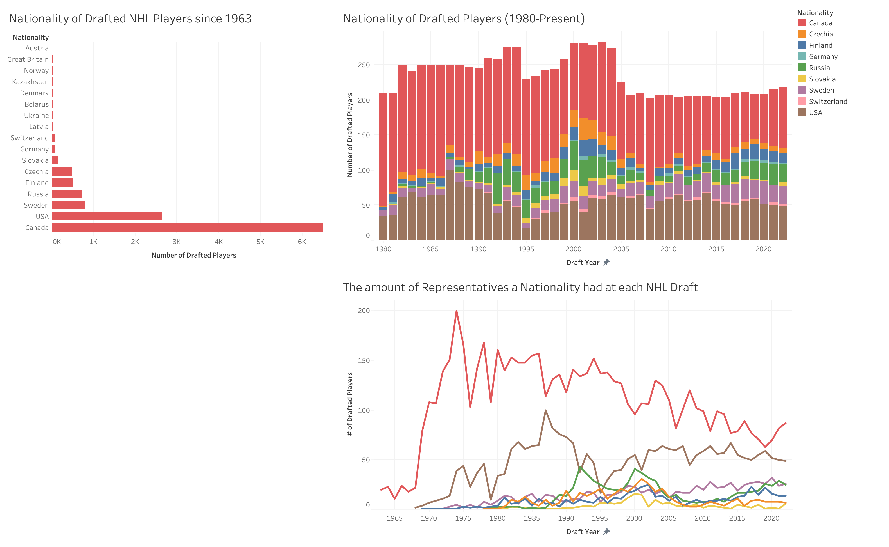
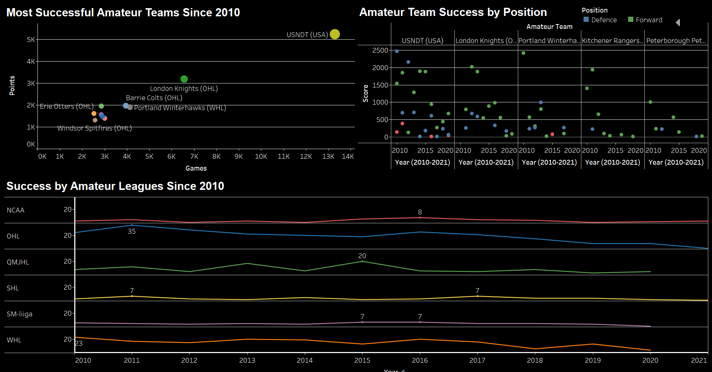

# Group 31 - NHL Dataset

- NHL Draft Statistics.

## Milestones

Details for Milestone are available on Canvas (left sidebar, Course Project).

## Describe your topic/interest in this dataset - answer in about 150-200 words

We have decided on a National Hockey League dataset due to our common interest in hockey. Our goal by the end of the project is to provide supporting evidence for under appreciated junior leagues and countries for the NHL draft. We are hopeful that we can bring more attention to young hockey players that are often not recognized in scouting. This project can display to NHL scouts the most underrated and most well developed junior leagues. Some more specific questions we would like to answer include exploring specifically which NHL team drafts the most successful NHL players in the league. Our group is also looking forward to researching which countries and which leagues develop the most drafted prospects. With this data we should have no problems creating a user-facing Dashboard.

## Describe your dataset in about 150-200 words

The NHL Players Statistics dataset is a collection of stats on every player who has been drafted into the National Hockey League since 1963. It includes the player’s draft year, junior team, as well as his career statistics in the NHL. The dataset also provides career totals and team information for each player. This dataset can be used to analyze player performance and identify trends and patterns in player development and success. It allows for comparisons between different draft classes and evaluations of team scouting and drafting processes. The data has been collected since 1963 by humans tracking each NHL game and logging the data. Additionally, the country of origin information can be used to study the distribution of NHL talent and determine which regions produce the most successful NHL players. The dataset provides valuable insights into the career of NHL players, as well as the value of draft picks in later rounds and the likelihood that a player makes the NHL. It is a useful resource for teams looking to draft talented players and what regions they should focus on youth scouting for their different positional needs. 

## Team Members

- Eric Harrison: I am, unfortunetely, a canucks fan.
- Logan Marshall: I have been a long tenured fan of hockey and sadly the canucks.
- Chase Winslow: I have wasted 11 years watching the Oilers. 

## Images
Dashboard
(N/A)
Dashboard 2

Dashboard 3

## References

https://www.kaggle.com/datasets/mattop/nhl-draft-hockey-player-data-1963-2022

