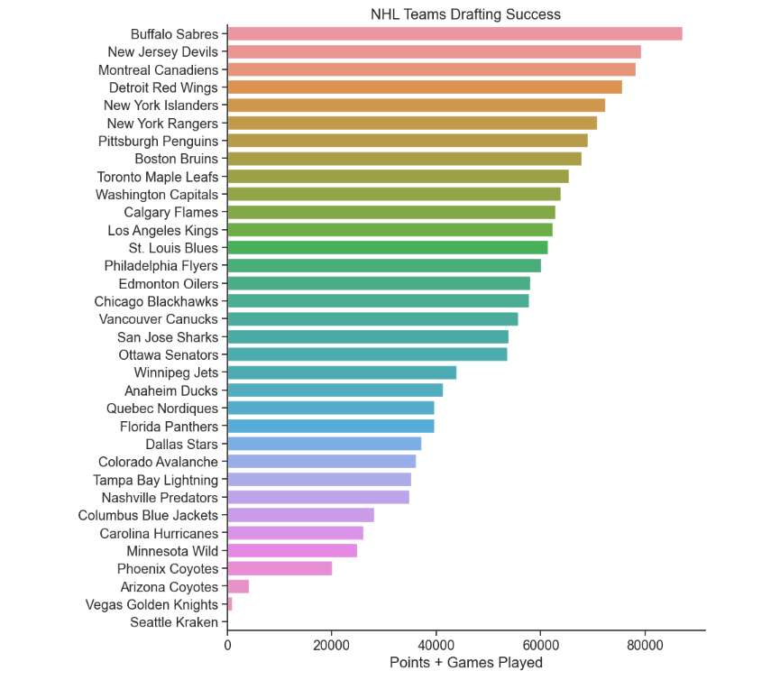
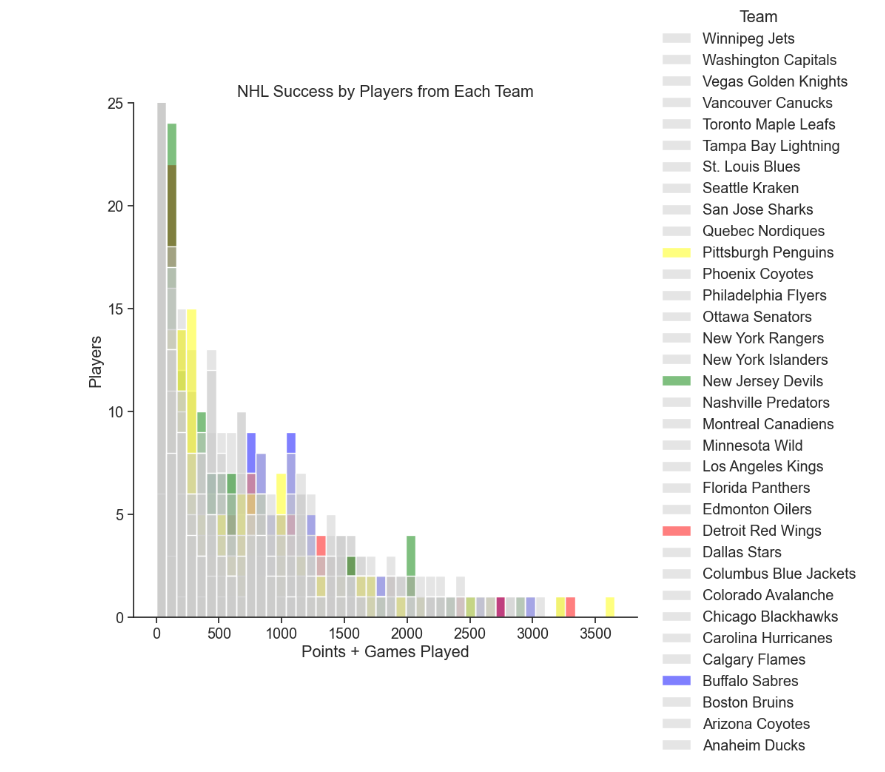
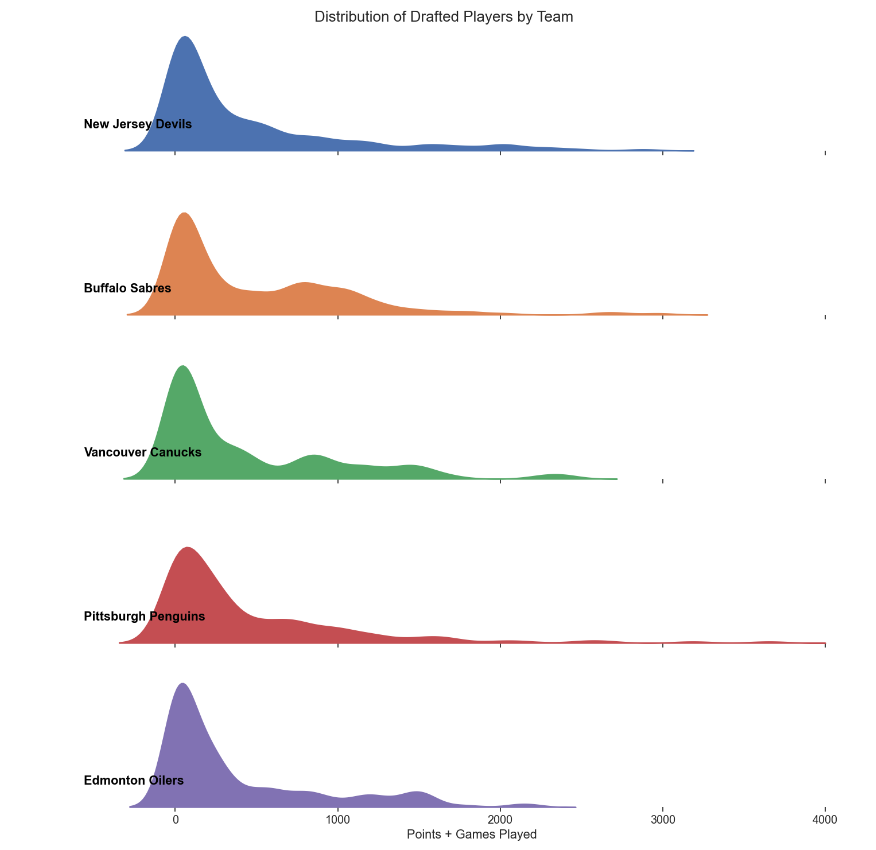

# Final Report - Group 31

## Introduction

Our group was interested in deeply researching the history of the NHL draft. We chose this topic because there is more depth to the NHL drafts than initially observed. Our group is made up of passionate hockey fans who enjoy watching these drafts for a "first look" at the upcoming future stars in the NHL. This project is important because it displays which junior leagues, NHL teams, and countries produce the most NHL drafted players.

## Exploratory Data Analysis

### Question 1
The first question regarding this dataframe was inquiring which teams have drafted the most successful players since 1982 and what led to their success. From the **first visualization**
   

it became clear that the Buffalo Sabres have by far the best drafting history. Other good teams include the Detroit Red Wings, New Jersey Devils, and Montreal Canadiens, however these teams are still noticeably worse than Buffalo. Through the **second visualization** and the **third visualization**
 
 

I could determine what makes the Buffalo Sabres so good at drafting. These visualizations made it clear that Buffalo doesn't have a lot of extremely high end talent drafted, however, they had a very large amount of players that wound up being average in the league drafted. While other teams, such as the Pittsburgh Penguins, drafted multiple of the best players in the league and yet remain average in total success from the draft. From this, I can conclude that the main reason Buffalo is better than the rest of the league at drafting is because they consistently draft NHL caliber players, while drafting less busts than the other teams.

### Question 2 
The second question regarding this dataframe was inquiring which countries have developed the most NHL prospects since 1963. From the first visualization, I was able to determine that Canada and USA are the main contributors for NHL prospects. A few european countries are not too far behind these two north american. Sweden, Russia, Finland, and Czechia have been developing their programs and producing more NHL prospects as of lately. I could conclude that previous statement by observing the second visualization. Before the 1970s, the NHL drafts consisted of almost entirely Canadian or American born players. However, throughout the years more european players started to be recognized and scouted. In recent years, Although Canadians and Americans still develop majority of the NHL prospects, less than usual are now drafted each year and there has been a continuous increase in European prospects. Perhaps, at some point in the future, a european country like Sweden or Russia will catch up to the USA or Canada for most NHL prospects.

### Question 3 
The third question regarding this dataframe was Inquiring which countries have developed the most NHL prospects since 1982.  From the first visualization, it became clear that the amateur teams playing in the Canadian Hockey League are the most successful at developing talent for the NHL. The second visualization shows how teams like the Kamloops Blazers have a golden age of talent, but have fallen off since, while teams like London have been more consistent. The third visualization shows the progress US hockey has made since 2010, they have jumped over all the Canadian teams by a huge margin. The forth visualization shows the reason why USNDT have been so successful since 2010, not only do they push out the most talent, but the most in all positions. The best two teams at developing amatuer talent are the USNDT and the London Knights. 

## Conclusion

Through this project we were able to determine that the vast majority of NHL prospects come from either Canada or the USA, through teams such as the USNDT and the London Knights. However, recently other countries such as Sweden, Finland and Russia have been rapidly improving the number of prospects they product through leagues such as Liiga or the SHL. As well as this, we were able to determine that the Buffalo Sabres have had the best history in their drafting, even though they haven't drafted as many individaul stars as teams like the Pittsburgh Penguins.